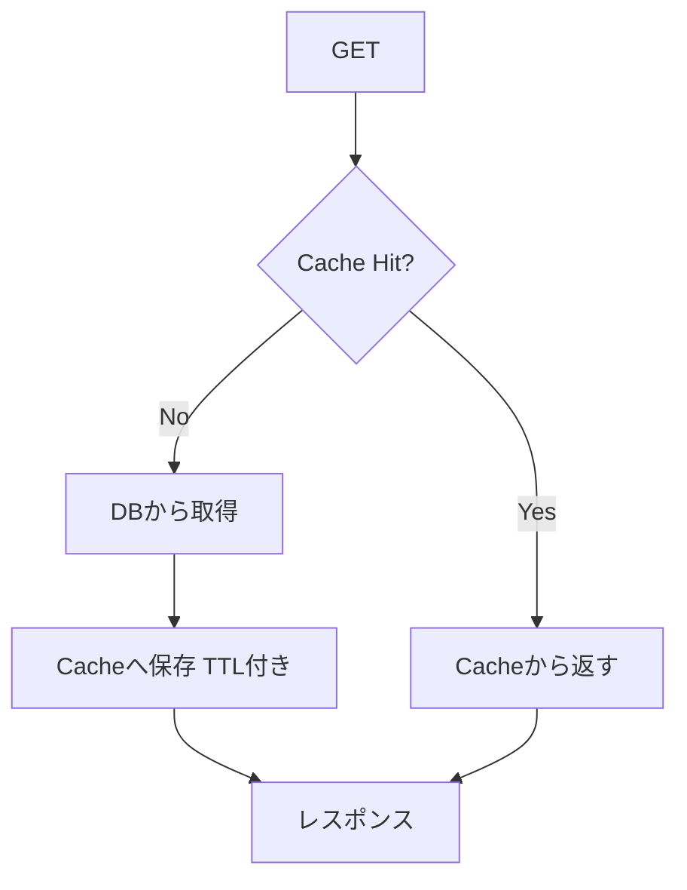
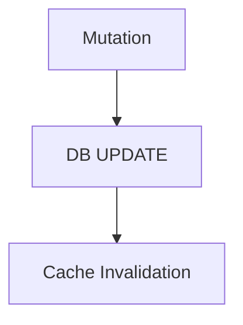
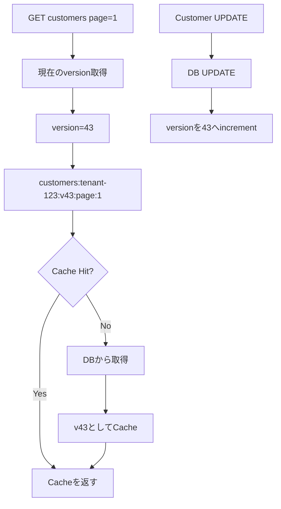
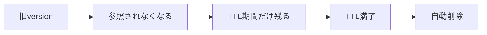
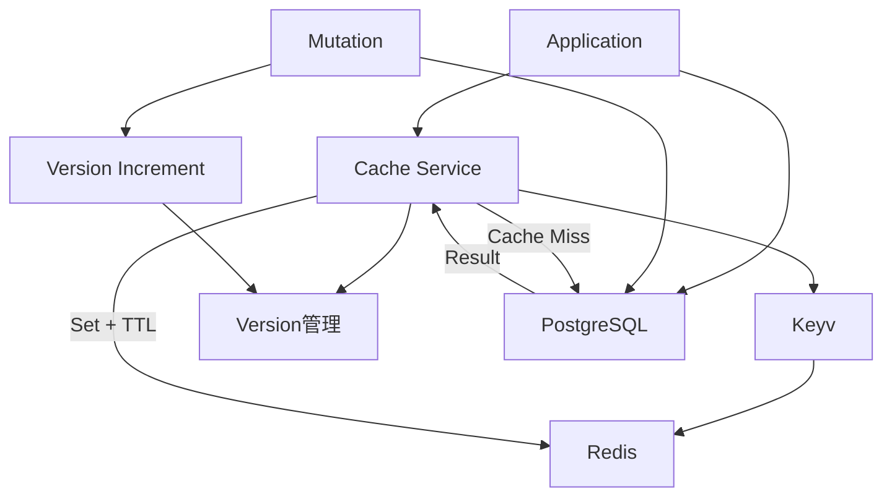

# 業務Webアプリにおけるサーバーサイドキャッシュ戦略

## 基本方針

業務Webアプリでは、単純に「DBクエリの結果をキャッシュする」のではなく、

> キャッシュする価値があるデータ・処理を選ぶ

という考え方が重要。

DBのインデックスやテーブル構造、SQLの最適化は前提として、その上でキャッシュを検討する。

特に重要なのは、

- アクセス頻度が高い
- DB負荷・計算コストが高い
- 同じ結果が繰り返し利用される
- 一定時間のstaleness（古さ）を許容できる

という条件。

---

## ユーザーごとに結果が違ってもキャッシュできる

例えば顧客一覧。

```sql
SELECT *
FROM customers
WHERE tenant_id = ?
ORDER BY created_at DESC
LIMIT 20 OFFSET 0;
```

ユーザーやテナントごとに結果が異なる場合でも、

```text
customers:tenant-123:page:1
customers:tenant-456:page:1
```

のようにキャッシュできる。

ただし、

> ユーザーごとに違う = 必ずキャッシュすべき

ではない。

適切なインデックスがあり、20件取得程度なら、PostgreSQLから直接取得した方がシンプルで十分高速な場合も多い。

---

# キャッシュ対象として有力なもの

| データ・処理 | キャッシュ |
|---|---|
| ユーザー情報 | ◎ |
| 権限・Role | ◎ |
| 設定値 | ◎ |
| マスターデータ | ◎ |
| カテゴリ | ◎ |
| 都道府県・国などの固定データ | ◎ |
| 外部APIレスポンス | ◎ |
| 重い集計処理 | ◎ |
| ダッシュボード集計 | ◎ |
| 顧客一覧 page=1 | △〜○ |
| 案件一覧 page=1 | △〜○ |
| page=2以降 | △ |
| 検索結果 | △ |
| リアルタイム在庫 | ×〜△ |
| 決済状態 | 基本× |
| 個人の細かいCRUD結果 | 基本× |

特に業務アプリでは、

- 顧客一覧
- 案件一覧
- ダッシュボード
- 設定値
- カテゴリ
- マスターデータ

などは候補になりやすい。

ページネーションについては、特にpage=1の利用頻度が高いなら短時間キャッシュする価値がある。

---

# 更新頻度が高くてもキャッシュできる

「更新が頻繁だからキャッシュできない」とは限らない。

例えば、

```text
TTL = 5秒
```

なら、

> 最大5秒古いデータを許容する

という設計になる。

一方、

- 在庫
- 残高
- 承認状態
- 決済状態

など、古さを許容できないデータはキャッシュしない。

つまり、

> キャッシュの可否は更新頻度そのものではなく、どの程度のstalenessを許容できるかで判断する。

---

# 基本戦略：Cache Aside + 長めのTTL + Invalidation

理想的には、



更新時には、



を行う。

TTLは長めに設定し、更新時には論理的に即座に古いキャッシュを無効化する。

TTLは、invalidateに失敗した場合などの安全弁、および物理的なcleanupとして使う。

---

# 物理削除ではなく「バージョン」を進める

大量のページネーションキャッシュを個別に削除するより、

> キャッシュの世代（version）を進める

方が扱いやすい。

例えば、

```text
cache-version:customers:tenant-123 = 42

customers:tenant-123:v42:page:1
customers:tenant-123:v42:page:2
customers:tenant-123:v42:page:3
```

顧客が更新されたら、

```text
cache-version:customers:tenant-123 = 43
```

とする。

すると次のアクセスでは、

```text
customers:tenant-123:v43:page:1
```

を見る。

v43が存在しなければ、

```text
DB
 ↓
v43としてキャッシュ
```

する。

v42は削除しなくても参照されなくなる。

---

# Versioned Cacheの考え方



例えば、

```text
v42
├── page:1
├── page:2
├── page:3
└── page:100

        ↓ UPDATE

v43
├── page:1 ← 最初のアクセスで生成
├── page:2 ← 最初のアクセスで生成
└── ...
```

となる。

100ページのキャッシュが存在していても、更新時に100個のキーを削除する必要はない。

versionを1回incrementするだけでよい。

---

# TTLの役割

VersionとTTLには別々の役割を持たせる。

```text
version
  ↓
論理的なinvalidate

TTL
  ↓
物理的なcleanup
```

例えば、

```text
customers:tenant-123:v42:page:1
TTL = 1時間
```

があったとして、更新によってv43になれば、v42は参照されなくなる。

その後、TTLが切れればRedisなどのストアから自然に消える。

したがって、基本的には古いversionを削除するための定期バッチは不要。



Redisを使う場合はRedis自身のTTL expirationによって削除される。

Keyvが定期的に全キーを走査して削除する、という仕組みではない。

---

# Keyv

Node.jsではKeyvが使いやすい。

Keyvはキャッシュストレージの抽象化を担当する。

例えばMemoryなら、

```ts
import Keyv from 'keyv'

const cache = new Keyv()
```

Redisなら、

```ts
const cache = new Keyv('redis://localhost:6379')
```

のようにできる。

そのため、

```text
開発環境
Keyv → Memory

単一インスタンス
Keyv → Memory

複数インスタンス
Keyv → Redis
```

という切り替えが比較的容易。

ただしMemoryはNode.jsプロセス単位。

```text
Node.js #1
  └── Keyv → Memory

Node.js #2
  └── Keyv → Memory
```

の場合、キャッシュは共有されない。

複数プロセス・複数コンテナで共有するならRedisなどの共有ストアを使う。

---

# Keyvでの基本的なCache Aside

```ts
import Keyv from 'keyv'

const cache = new Keyv('redis://localhost:6379')

const CACHE_TTL = 60 * 60 * 1000

async function getCustomers(
  tenantId: string,
  page: number,
) {
  const key = `customers:${tenantId}:page:${page}`

  const cached = await cache.get(key)

  if (cached) {
    return cached
  }

  const result = await loadCustomersFromDB(
    tenantId,
    page,
  )

  await cache.set(
    key,
    result,
    CACHE_TTL,
  )

  return result
}
```

---

# getOrSetを薄いラッパーにする

アプリケーション側で毎回、

```text
get
 ↓
Hit?
 ↓ No
DB
 ↓
set
```

を書くのは面倒なので、薄いラッパーを作る。

```ts
async function cached<T>(
  cache: Keyv,
  key: string,
  factory: () => Promise<T>,
  ttl: number,
): Promise<T> {
  const cached = await cache.get<T>(key)

  if (cached !== undefined) {
    return cached
  }

  const value = await factory()

  await cache.set(key, value, ttl)

  return value
}
```

利用側は、

```ts
const result = await cached(
  cache,
  `customers:${tenantId}:page:${page}`,
  () => loadCustomersFromDB(tenantId, page),
  60 * 60 * 1000,
)
```

程度になる。

---

# Versioned Cacheを自前で薄く抽象化する

Keyv自体は「顧客が更新されたら顧客一覧をinvalidateする」といったドメイン固有の戦略までは担当しない。

そのため、

```text
Keyv
  ↓
キャッシュストレージ抽象化

自前CacheService
  ↓
version
invalidate
getOrSet
キー生成
```

という分離が自然。

例えば、

```ts
class VersionedCache {
  constructor(
    private cache: Keyv,
  ) {}

  async getVersion(
    namespace: string,
    scope: string,
  ): Promise<number> {
    return (
      await this.cache.get<number>(
        `cache-version:${namespace}:${scope}`,
      )
    ) ?? 1
  }

  async key(
    namespace: string,
    scope: string,
    key: string,
  ): Promise<string> {
    const version = await this.getVersion(
      namespace,
      scope,
    )

    return `${namespace}:${scope}:v${version}:${key}`
  }
}
```

利用側は、

```ts
const key = await cache.key(
  'customers',
  tenantId,
  `page:${page}`,
)
```

とできる。

---

# Mutation時のinvalidate

顧客を更新した場合、

```ts
await updateCustomer(customerId, data)

await cache.bumpVersion(
  'customers',
  tenantId,
)
```

とする。

重要なのは、

> キャッシュを全部削除するのではなく、最新versionを進める

ということ。

---

# Redisでのversion incrementには注意

複数Node.jsプロセスから同時にversionを更新する場合、

```ts
const version = await cache.get(key)
await cache.set(key, version + 1)
```

では競合する可能性がある。

例えば、

```text
A: get → 10
B: get → 10
A: set → 11
B: set → 11
```

となる。

Redisを使うなら、

```text
INCR cache-version:customers:tenant-123
```

のようにRedisのatomic operationを利用する。

つまり、

```text
通常のキャッシュ
    ↓
Keyvで抽象化

version increment
    ↓
RedisではINCRなどを利用
```

とする。

MemoryでもRedisでも同じAPIでversioningしたい場合は、自前のVersionedCache層でストアごとの差異を吸収する。

---

# ページネーションキャッシュ

業務アプリでは、

- 顧客一覧
- 案件一覧
- 商品一覧
- 問い合わせ一覧

など、一覧画面のpage=1が非常によく使われる。

そのため、

```text
customers:tenant-123:v43:page:1
projects:tenant-123:v18:page:1
```

などを短〜中程度のTTLでキャッシュするのは合理的。

一方、page=2以降まで無条件にキャッシュすると、キャッシュキーが大量になる可能性がある。

そのため、

```text
page=1
  ↓
積極的にキャッシュ

page=2以降
  ↓
アクセス頻度・DB負荷を見て判断
```

という戦略も有効。

大量データではOFFSET paginationよりcursor paginationも検討する。

---

# ページネーションでのinvalidate

例えば、

```text
v42
├── page=1
├── page=2
├── page=3
└── page=100
```

が存在している状態で顧客が追加されたとしても、

```text
全pageをDELETE
```

する必要はない。

```text
version 42 → 43
```

だけでよい。

その後、

```text
page=1
```

がアクセスされたら、

```text
customers:tenant-123:v43:page:1
```

をDBから生成してキャッシュする。

---

# 設定値・カテゴリ・マスターデータ

設定値やカテゴリは特にキャッシュしやすい。

例えば、

```ts
const version = await cache.getVersion(
  'settings',
  tenantId,
)

const key =
  `settings:${tenantId}:v${version}`
```

として、

```text
TTL = 24時間
```

などにする。

更新時は、

```ts
await updateSetting(...)

await cache.bumpVersion(
  'settings',
  tenantId,
)
```

だけ。

TTLが24時間でも、更新後はversionが変わるため、次のアクセスでは必ず新しいキャッシュを参照する。

---

# 最終的な構成

業務Webアプリなら、次のような構成が扱いやすい。



役割を分けると、

```text
PostgreSQL
    ↓
正規のデータソース

Keyv
    ↓
キャッシュAPIの抽象化

Redis
    ↓
共有キャッシュストレージ

VersionedCache / CacheService
    ↓
versioning
getOrSet
invalidate
キー生成

TTL
    ↓
古いキャッシュのcleanup
```

となる。

---

# Goの場合

GoではKeyvに近い立ち位置のライブラリとして `eko/gocache` が候補。

```text
Node.js
  Keyv
    ↓
Memory / Redis

Go
  eko/gocache
    ↓
Memory / Redis
```

`gocache`は、

- Memory
- Redis
- TTL
- Cache Aside
- Chain Cache
- Tagによるinvalidate

などを扱える。

特に、

```text
L1: Memory
    ↓ miss
L2: Redis
    ↓ miss
DB
```

のような多層キャッシュも構築できる。

ただし、今回のようなドメイン固有のversioning戦略については、Node.jsと同様に薄い自前抽象化を置くのが自然。

---

# 推奨する考え方

最終的には、

```text
DBを速くする
    ↓
それでも重い処理を特定
    ↓
Cache Aside
    ↓
Keyv / Redis
    ↓
長めのTTL
    ↓
Mutation時にversion increment
    ↓
旧versionは参照しない
    ↓
TTLで自然消滅
```

という設計。

つまり、

> **Version = 論理的なinvalidate**
>
> **TTL = 物理的なcleanup**

と考える。

キャッシュを「正しいデータの保存場所」にするのではなく、

> **PostgreSQLを正として、Redis/Keyvは読み取り高速化のための一時的な層**

として扱うのが基本。

この方式なら、顧客一覧・案件一覧・設定値・カテゴリ・マスターデータなどを、比較的シンプルなルールで横断的にキャッシュできる。
